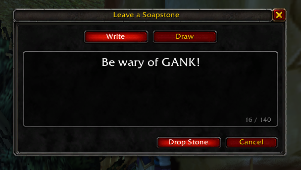
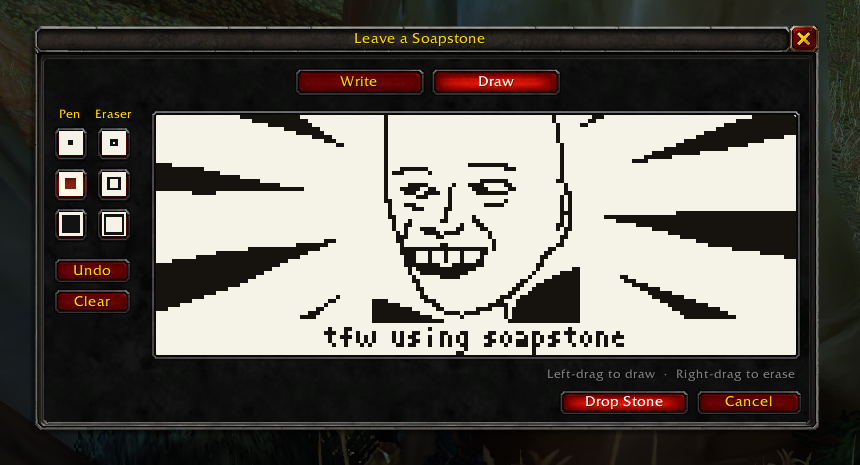
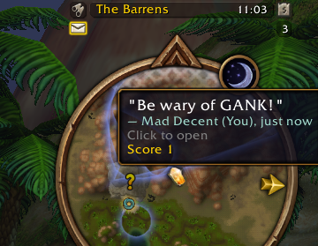
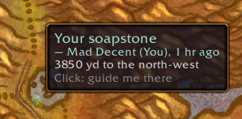
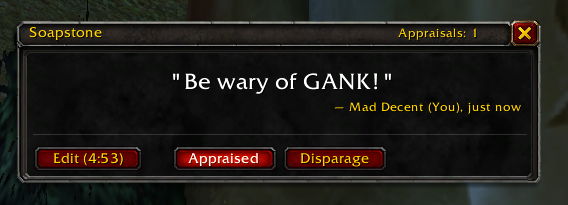
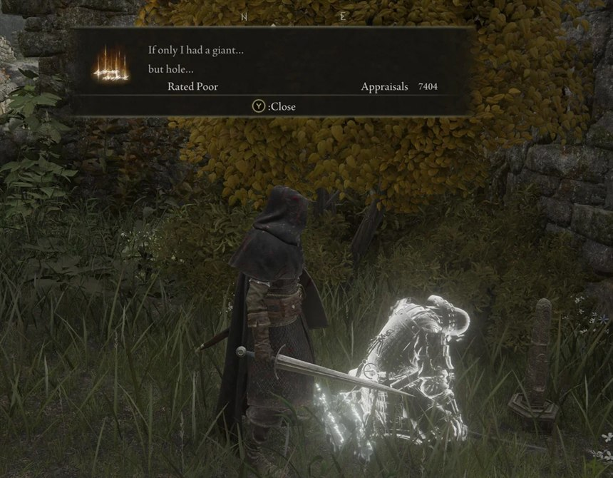
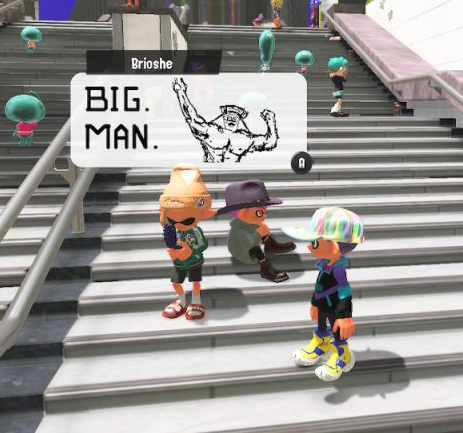

# Soapstone for World of Warcraft

> Leave your mark, literally. Scribble doodles and drop secret messages wherever you go, visible only to players who wander into the area.

Soapstone lets you leave short messages and little drawings at spots in the
world, like the orange soapstone messages in *Dark Souls* or doodles like in 
*Splatoon 3*. A stone stays sealed until someone walks right up to it. Then 
it opens, and they can read what you left there: a warning, a tip, a joke, 
a view worth stopping for.

Your minimap shows stones nearby and pulls you toward the sealed ones, with
a soft sound when one is close.

Made for **WoW Forever** (currently in beta).

**[Get Soapstone on CurseForge](https://www.curseforge.com/wow/addons/soapstone)**

## Screenshots

**Leave a stone:** write a message, or draw one.

  
  

**Find it:** its pin on the minimap, and on the world map with how far away
it is. Open it to read, appraise or disparage it.

  
  

  

## Install

Soapstone has two parts: the addon, and the
**[Soapstone companion](#sharing-with-other-players)**, a small app that
sits in your system tray and connects you to everyone else. It brings
other players' stones into your world and carries yours into theirs.

1. **Get the addon from
   [CurseForge](https://www.curseforge.com/wow/addons/soapstone).** The
   CurseForge app is the best way: it puts Soapstone in the right folder
   and keeps it up to date along with the rest of your addons.
2. **Get the companion.** Download the latest
   `Soapstone-Companion-vX.Y.Z-setup.exe` from the
   [Releases page](https://github.com/georgeplendl/Soapstone-WoW/releases)
   and run it. It installs just for your Windows user (no admin prompt)
   and starts with Windows, so it's always ready to share. It leaves the
   CurseForge app's copy of the addon alone unless it carries a newer
   version, and if you skipped step 1, it installs the addon for you.
3. **Restart the game** once so it picks up the new files. A soapstone
   button appears on your minimap.

Keep the companion running while you play. It's what shares your stones
with other players and brings theirs to you.

> **Coming soon:** the companion for macOS.

> **Beta.** The companion is new, so expect rough edges. Until its
> installer is code-signed, Windows may say "Windows protected your PC":
> choose **More info**, then **Run anyway**. Each release lists the
> installer's SHA-256 checksum, so you can check your download.

What's new in each version is in the [changelog](CHANGELOG.md).

## How to play

- **Leave a stone:** click the soapstone button on your minimap, or type
  `/soap`. Write up to 140 letters, or switch to **Draw** and sketch
  something. Press **Drop Stone** and it's left right where you stand.
- **Find stones:** pins on your minimap point to stones nearby, and you'll
  hear a soft sound when an unread one is close. The world map shows every
  stone you know of and how far away it is.
- **Read a stone:** walk up to it. Within about 40 yards it opens: the
  minimap button glows, and you can click its pin to read it. Once you've
  read a stone, come back any time to read it again.
- **Get directions:** click a stone on the world map to be guided there.
  With [TomTom](https://www.curseforge.com/wow/addons/tomtom) installed you
  get its arrow; otherwise you get the game's own map pin.
- **Appraise or disparage:** praise a stone you liked, or mark one you
  didn't. Appraised pins turn gold. Disparaged ones fade and stop calling
  you over. A stone's score adds up every player's votes, and its pin
  shows how many players have found it.
- **Change your mind:** for 5 minutes after dropping a stone, you can edit
  or delete it from its window.

Each of your characters finds stones for themselves: a stone your main has
read is still sealed for your alts.

## Commands

| Command | What it does |
|---|---|
| `/soap` | Leave a stone where you stand |
| `/soap list` | Stones nearby, nearest first |
| `/soap read` | Open the nearest stone you're close enough to read |
| `/soap guide` | Point the way to the nearest sealed stone (`/soap guide off` stops) |
| `/soap companion` | Where to get the Soapstone companion, which shares your stones with other players |
| `/soap sync` | Reload the UI so the companion syncs now (also: shift-click the minimap button) |
| `/soap sound` | Turn the sound cues on or off |
| `/soap button` | Show or hide the minimap button |
| `/soap help` | Every command |

## Sharing with other players

The **Soapstone companion** is a small app that sits in your system tray
next to WoW and shares stones with everyone through a shared database:
stones other players left show up when you log in, along with their
drawings, and yours reach them the same way. If you don't use the
CurseForge app, it also installs and updates the addon for you (see
[Install](#install)).

It only reads and writes Soapstone's own files, the way the WeakAuras
Companion does, and never touches the game itself. Because WoW only loads
files when you log in or reload, new stones arrive at your next login or
`/reload`. While WoW is running, the companion checks for new stones every
3 minutes. Shift-click the minimap button (or type `/soap sync`) to reload
right away: the companion shares your new stones within seconds, and you
get every stone it has fetched so far.

What the companion sends, and who can see it, is in the
[privacy policy](PRIVACY.md). To uninstall it, use Windows Settings >
Apps > Soapstone; that also removes it from Windows startup.

## Inspiration

Soapstone grew out of two games. In *Elden Ring* and *Dark Souls*, players
leave messages on the ground for strangers to find and rate. In
*Splatoon 3*, players' drawings pop up around the plaza. Soapstone brings
both to Azeroth.

  
  

*Left: a message in Elden Ring. Right: a drawn post in Splatoon 3.*

Soapstone is also a spin-off of
[Soapstone](https://github.com/georgeplendl/Soapstone), a phone app for
leaving voice messages at real-world places.

Want to build or change Soapstone? See the
[developer notes](docs/Development.md).

## Code signing policy

Free code signing provided by [SignPath.io](https://about.signpath.io/),
certificate by [SignPath Foundation](https://signpath.org/).

- **Committers and reviewers:** [George Plendl](https://github.com/georgeplendl)
- **Approvers:** [George Plendl](https://github.com/georgeplendl)

The companion's Windows installer is built from this repository's source by
GitHub Actions ([`companion-release.yml`](.github/workflows/companion-release.yml))
and signed only after the maintainer approves each release. Signing is
still being set up, so installers up to v0.2.2 are not signed yet.

**Privacy policy:** the companion sends the Soapstone server your
characters' names, the stones you leave and change, your appraisals and
reports, and which stones your characters have opened; the installer shows
this before you install. See
the full [privacy policy](PRIVACY.md). The addon itself sends nothing; all
sharing goes through the companion. (The one exception is an older,
experimental player-to-player network, `/soap net join`, which is off by
default.)

## Support

Soapstone is free. If you enjoy it, you can buy me a coffee:

